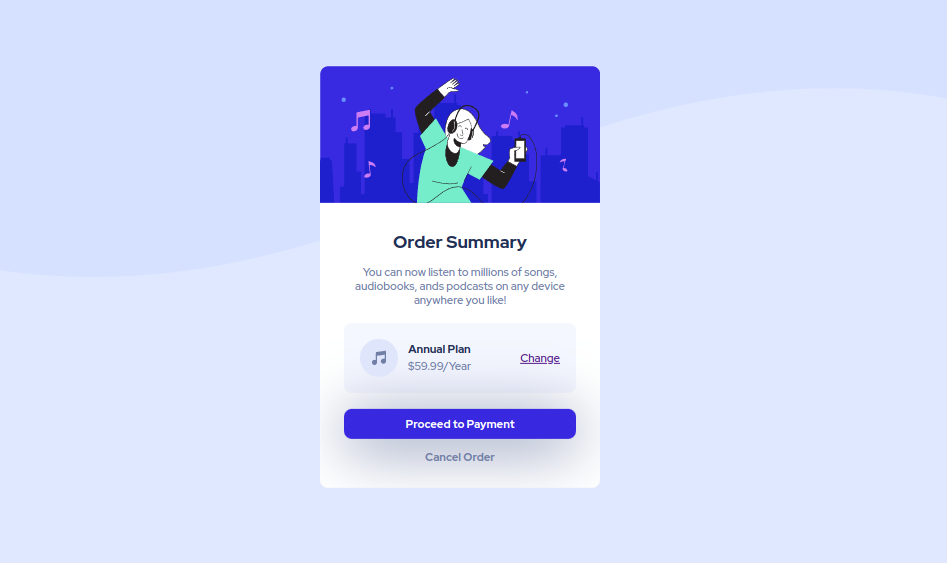

# Frontend Mentor - Order summary card solution

This is a solution to the [Order summary card challenge on Frontend Mentor](https://www.frontendmentor.io/challenges/order-summary-component-QlPmajDUj). Frontend Mentor challenges help you improve your coding skills by building realistic projects. 

## Table of contents

- [Overview](#overview)
  - [The challenge](#the-challenge)
  - [Screenshot](#screenshot)
  - [Links](#links)
- [My process](#my-process)
  - [Built with](#built-with)
  - [What I learned](#what-i-learned)
  - [Useful resources](#useful-resources)
- [Author](#author)
- [Acknowledgments](#acknowledgments)

**Note: Delete this note and update the table of contents based on what sections you keep.**

## Overview

### The challenge

Users should be able to:

- See hover states for interactive elements

### Screenshot

Here is the screenshot of the finished mobile component.

and the corresponding desktop component.

### Links

- Live Site URL: [Netlify](https://jakegodsall-order-summary.netlify.app/)

## My process

### Built with

- Semantic HTML5 markup
- CSS custom properties
- Flexbox
- Mobile-first workflow

### What I learned

1. How to use hover states for elements.
2. How to use box shadow to give buttons a three-dimensional effect.

### Useful resources

- [120 Best CSS button hover effects (Warren Davies)](https://alvarotrigo.com/blog/best-css-button-hover-effects/) - There are tons of great ideas for creating beautiful hover states for buttons. I am going to go through this more thoroughly soon.

## Author

- Website - [Jake Godsall](https://jakegodsall.com)
- Frontend Mentor - [@jakegodsall](https://www.frontendmentor.io/profile/jakegodsall)
- LinkedIn - [@godsalljake](https://linkedin.com/in/godsalljake)
