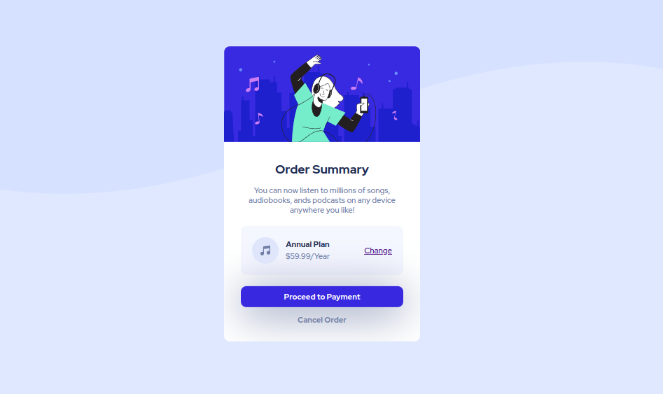

# Order Summary Component (Frontend Mentor)

This repository contains my solution for the [Order Summary Card challenge](https://www.frontendmentor.io/challenges/order-summary-component-QlPmajDUj) on Frontend Mentor. The live version of the project can be viewed [here](https://jakegodsall-order-summary.netlify.app/).

## Overview

### The challenge

Users should be able to:

-   See hover states for interactive elements

### Screenshot

Here is the screenshot of the finished mobile component.

and the corresponding desktop component.

### Links

-   Live Site URL: [Netlify](https://jakegodsall-order-summary.netlify.app/)

## My process

### Built with

-   Semantic HTML5 markup
-   CSS custom properties
-   Flexbox
-   Mobile-first workflow

### What I learned

1. How to use hover states for elements.
2. How to use box shadow to give buttons a three-dimensional effect.

### Useful resources

-   [120 Best CSS button hover effects (Warren Davies)](https://alvarotrigo.com/blog/best-css-button-hover-effects/) - There are tons of great ideas for creating beautiful hover states for buttons. I am going to go through this more thoroughly soon.

## Author

-   Website - [Jake Godsall](https://jakegodsall.com)
-   Frontend Mentor - [@jakegodsall](https://www.frontendmentor.io/profile/jakegodsall)
-   LinkedIn - [@godsalljake](https://linkedin.com/in/godsalljake)

### Notes

This project was originally completed on 26th July 2022.

This repository is part of a series of repositories that have recently been cleaned and updated as part of an overhaul of my GitHub profile. The purpose of this overhaul was to ensure that each repository reflects my current development standards and practices, and to provide a cleaner, more professional appearance.

The project is updated as of 21st December 2023.

## License

This project is open source and available under the [MIT License](https://github.com/jakegodsall/fm-order-summary-component/blob/master/LICENSE).
